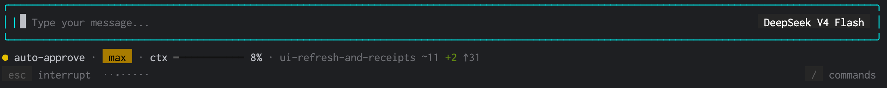

# Heirloom

[](https://github.com/amenski/heirloom-agent/actions/workflows/build.yml)
[](./LICENSE)
[](https://nodejs.org)

A personal AI coding agent for the terminal — bring your own key, use any model,
readable codebase.

---

## Install

```bash
git clone https://github.com/amenski/heirloom-agent.git
cd heirloom-agent
npm install
npm run build && npm link
```

Then add an API key:

```bash
heirloom auth                    # guided setup (stores in ~/.heirloom/credentials.yaml)
export DEEPSEEK_API_KEY=...      # or set an env var
```

Launch:

```bash
heirloom                         # interactive
heirloom "explain src/foo.ts"    # start with a prompt
heirloom -c                      # continue the most recent session
heirloom -p "..."                # one-shot, no TUI (for scripts)
heirloom doctor                  # verify your setup
```

Prefer a real binary? Build once and link it:

```bash
npm run build
npm link          # now `heirloom` is on your PATH
heirloom          # same thing, no `npm start --`
```

Check your setup any time with `heirloom doctor`.

---

<p align="center">
  
</p>

---

## Everyday use

```
heirloom [code] > /mode ask       switch persona (read-only)
heirloom [ask]  > Shift+Tab        toggle askAll / allowAll posture
heirloom [ask ⚡] >
```

| Keys / commands | |
|---|---|
| `Enter` | send · `Shift+Enter` newline |
| `Esc` | interrupt the current turn — nothing partial is saved |
| `Shift+Tab` | toggle the approval posture |
| `/` | open the command menu |
| `/help` | full command list |
| `/model`, `/effort` | pick model · set reasoning effort |
| `/new`, `/resume`, `/continue` | session management |
| `/undo` | rewind code and/or conversation |
| `/theme` | switch color theme (live preview) |
| `/permissions` | this session's permission history |
| `/skills`, `/mcp` | list skills · inspect MCP servers |
| `Ctrl+D` twice | quit |

### CLI flags

| Flag | Meaning |
|---|---|
| `[prompt]` | positional prompt to submit on launch |
| `-p, --print` | print the response and exit, non-interactive (needs a prompt) |
| `-r, --resume [id]` | resume a session by ID, or open the picker |
| `-c, --continue` | continue the most recent session for this directory |
| `--model <provider/model>` | override the configured model |
| `--mode <name>` | start in a given mode |
| `-d, --debug` | write redacted request/response JSONL |

```bash
cat error.log | heirloom -p "Explain this error"
```

---

## Configuration

Create `~/.heirloom/settings.json` (or `./.heirloom/settings.json` per project;
project wins when both exist):

```jsonc
{
  "model": "deepseek-v4-pro",
  "provider": "deepseek",
  "permissions": {
    "defaultMode": "askAll",
    "rules": [
      { "tool": "read_file",     "pattern": "./**", "action": "allow" },
      { "tool": "write_to_file", "pattern": "./**", "action": "allow" },
      { "tool": "run_bash",      "pattern": "*",    "action": "ask"   }
    ]
  },
  "mcpServers": {
    "filesystem": { "command": "npx", "args": ["-y", "@modelcontextprotocol/server-filesystem", "."] }
  }
}
```

- Store API keys in `~/.heirloom/credentials.yaml` (via `heirloom auth`) or env
  vars — not in settings.json.
- Project instructions: `.heirloom/instructions.md` (or `AGENTS.md`).
- Custom modes: drop a YAML file into `~/.heirloom/modes/`.

Full schema: [`docs/config-spec.md`](./docs/config-spec.md).

---

## Features

### Persona modes

`code` (read/write/run), `ask` (read-only), `architect` (plan in docs),
`debug` (investigate), `orchestrator` (delegate tasks). Each mode gates which
tools the model sees. Switch anytime with `/mode <slug>`.

### Permission rules

Allow, ask, or deny tools by name and pattern. Shortcut: `Shift+Tab` cycles
`normal → auto-approve → plan`. Every decision is recorded (`/permissions`).

### Checkpoints

Every file edit is backed up in a shadow Git repo. `/undo` rewinds code,
conversation, or both.

### Resumable sessions

Conversations are append-only JSONL files. Long chats stay usable through
automatic compaction. Resume with `--continue`, `--resume <id>`, or `/resume`.

### Skills & MCP

Install [Agent Skills](https://agentskills.io) or connect MCP servers. Browse
with `/skills` and `/mcp`.

### Web search

`web_search` works with no API key, backed by Bing's keyless RSS feed, and
`web_fetch` reads any result in full. Both ask before running and treat what
comes back as untrusted input.

Because that feed is undocumented, it can change shape without notice. When a
response no longer parses as RSS, the tool says so explicitly rather than
reporting "no results" — a broken search never masquerades as an empty web.
For a stronger index, add a search MCP server with your own key
([`docs/config-spec.md`](./docs/config-spec.md)); Heirloom ships none and
stores no keys.

### Stale-file detection

The agent tracks when it last read each file and refuses to overwrite changes
you made outside it.

### Streaming & observability

Replies stream as they generate. `/cost` shows session token usage. `/theme`
switches color schemes with a live preview. `/doctor` runs diagnostics.

## Supported models

- `deepseek-v4-pro` (primary, best tested)
- `deepseek-v4-flash`
- Any DeepSeek, OpenAI, OpenRouter, Groq, or Ollama model
- Any OpenAI-compatible provider via config

---

## FAQ

### Why another AI coding agent?

Heirloom started as a fix for an agent that broke inside IntelliJ's embedded
terminal. It grew into a full tool by combining the best ideas from opencode,
RooCode, Aider, and SWE-agent — modes, checkpoints, permission rules — with
zero telemetry and no vendor lock-in. Every design decision is documented in
[`docs/`](./docs/).

### Does it send my data anywhere?

No. Heirloom sends nothing anywhere except to the model provider you configured.
There is no telemetry, no analytics, no phoning home.

### Is it safe to use on production code?

Heirloom executes model-chosen commands on your machine. The permission system
is the safety net — read [`docs/security-spec.md`](./docs/security-spec.md)
before enabling auto-approve on code you didn't write.

### How do I configure MCP?

Add `mcpServers` to settings.json (see Configuration above), then use `/mcp` to
inspect connected servers. See [`docs/config-spec.md`](./docs/config-spec.md).

### How do I get notified when a task completes?

Set `notify` in settings.json to the path of a notification script.
See [`docs/notify-spec.md`](./docs/notify-spec.md).

### Does it support images?

Yes — paste an image with `Ctrl+V`. The model must support multimodal input.

### Does it support Thinking mode?

Yes. Set `thinkingEnabled: true` in settings.json. DeepSeek models support
reasoning effort control (`/effort`).

---

## Docs

| | |
|---|---|
| [architecture.md](./docs/architecture.md) | Design layers and tradeoffs |
| [subsystems.md](./docs/subsystems.md) | Index: memory, context, ReAct, failure modes |
| [tool-spec.md](./docs/tool-spec.md) | Built-in tool contracts |
| [provider-spec.md](./docs/provider-spec.md) | Model adapter interface |
| [config-spec.md](./docs/config-spec.md) | Settings reference |
| [mode-spec.md](./docs/mode-spec.md) | Persona definitions |
| [permission-spec.md](./docs/permission-spec.md) | Rules, approvals, prompts |
| [session-spec.md](./docs/session-spec.md) | Conversation storage format |
| [skill-spec.md](./docs/skill-spec.md) | Skill format and loading |
| [cli-spec.md](./docs/cli-spec.md) | Flags, commands, keybindings |
| [security-spec.md](./docs/security-spec.md) | Threat model and mitigations |
| [conventions.md](./docs/conventions.md) | Code style and testing |

---

## Contributing

```bash
git clone https://github.com/amenski/heirloom-agent.git
cd heirloom-agent
npm install
npm test              # vitest — 1,059 tests
npx tsc --noEmit      # type gate
npm run build         # bundle with tsup
```

See **[CONTRIBUTING.md](./CONTRIBUTING.md)** for the PR checklist, code map,
and good first contributions. [Code of Conduct](./CODE_OF_CONDUCT.md) applies.

---

## License

[Apache 2.0](./LICENSE)
